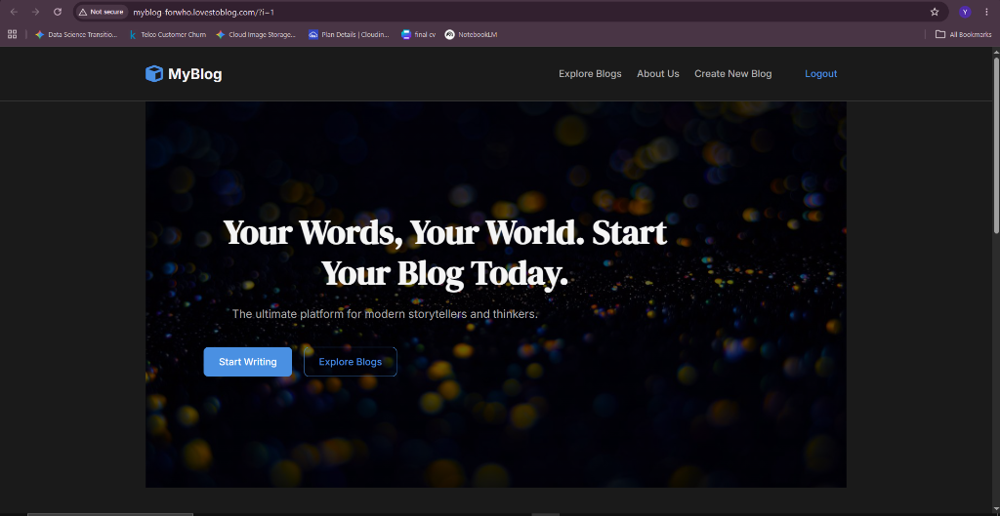
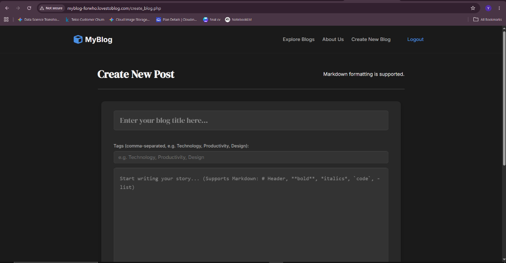
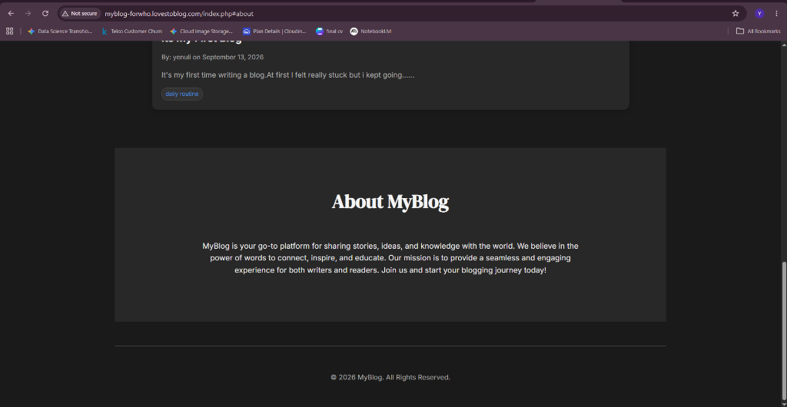
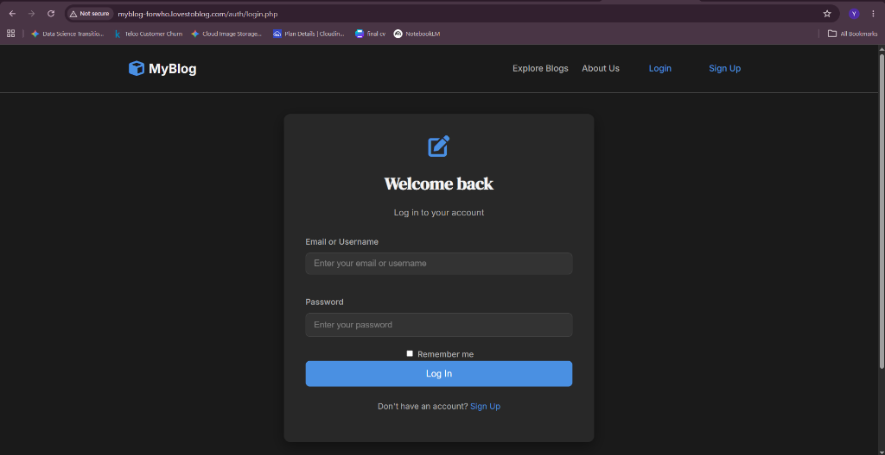

# 🚀 MyBlog - Modern PHP & MySQL Blogging Platform


**MyBlog** is a feature-rich, minimalist blog application built with HTML5, CSS3, Vanilla JavaScript, native PHP (PDO), and MySQL. It empowers writers to create, publish, tag, edit, and manage stories while providing readers with an engaging, dark-themed reading experience.

🌐 **Live Demo**: [http://myblog-forwho.lovestoblog.com/](http://myblog-forwho.lovestoblog.com/)

---

## 🖼️ Application Screenshots

| Homepage & Hero Section | Post Editor & Markdown Support |
| :---: | :---: |
|  |  |
| *Glassmorphic navigation bar, trending posts, and live keyword search* | *Rich post editor with image uploads, tags, and Markdown parsing* |

| About Section & Blog Cards | Authentication Interface |
| :---: | :---: |
|  |  |
| *Responsive blog cards with reading time badges and like counters* | *Secure authentication with password toggle and Remember Me* |

---

## ✨ Features & Highlights

### 🔑 Authentication & Session Security
- **User Authentication**: Secure registration, login, and session destruction.
- **HMAC Signed "Remember Me" Cookies**: Uses HMAC SHA-256 signatures (`user_id:signature`) to prevent cookie forgery and account impersonation.
- **Session Fixation Defense**: Automatically regenerates session IDs (`session_regenerate_id(true)`) upon authentication.

### 🛡️ Security Hardening
- **Anti-CSRF Tokens**: All POST forms include anti-CSRF token fields (`csrf_field()`) and server-side verification (`verify_csrf_token()`).
- **PDO Prepared Statements**: Prevents SQL injection across all database queries.
- **MIME & Extension Upload Validation**: Image uploads validate both file extensions (`jpg`, `jpeg`, `png`, `gif`, `webp`) and binary MIME types (`mime_content_type()`).
- **HTTP Security Headers**: Enforces `X-Content-Type-Options: nosniff`, `X-Frame-Options: SAMEORIGIN`, `X-XSS-Protection`, and `Referrer-Policy`.
- **Upload Execution Lockdown**: `.htaccess` protection in `/uploads/images/` blocks execution of scripts (`.php`, `.phtml`, `.exe`).

### 📝 Content & Interactive Features
- **Markdown Parsing**: Renders Markdown syntax (`# Headers`, `**bold**`, `*italics*`, `` `code` ``, `> quotes`, `- lists`) safely with XSS protection (`htmlspecialchars`).
- **Category Tags & Filtering**: Tag posts with comma-separated tags and filter posts on the homepage by clicking tag badges.
- **Live AJAX Liking**: Non-blocking asynchronous Like/Unlike button updates counts instantly without page reloads.
- **Estimated Reading Time**: Dynamic reading time calculation (`e.g. 2 min read`) on blog cards.
- **Keyword Search**: Homepage search bar to search posts by title, content, or tags.

### 🎨 Visual & UI Design
- **Glassmorphic Sticky Header**: Sticky top navigation bar with backdrop blur filter (`backdrop-filter: blur(14px)`).
- **Interactive Card Hover Animations**: Smooth image scale zoom and glowing neon borders on hover.
- **Custom Dark Theme**: Modern dark mode aesthetics built with custom CSS variables.

---

## 🛠️ Technology Stack

| Layer | Technologies Used |
| :--- | :--- |
| **Frontend** | HTML5, CSS3 (Variables, Flexbox/Grid, Glassmorphism), Vanilla JS (Fetch API) |
| **Icons & Fonts** | Font Awesome 6, Google Fonts (*DM Serif Display*, *Inter*) |
| **Backend** | PHP 7.4+ / PHP 8.x (PDO Object-Oriented Interface) |
| **Database** | MySQL (InnoDB Engine, Foreign Key Constraints & Cascades) |
| **Security** | CSRF Tokens, HMAC SHA-256 Cookie Signing, Password Bcrypt Hashing |
| **Deployment** | InfinityFree / cPanel / Apache Web Server |

---

## 📁 Repository Structure

```
myblog/
├── actions/
│   ├── delete_blog.php       # Handles post deletion with ownership & CSRF checks
│   └── toggle_like.php       # Handles AJAX & standard POST like toggling
├── auth/
│   ├── login.php             # User login & HMAC Remember Me cookie setting
│   ├── logout.php            # Session destruction & cookie invalidation
│   └── register.php          # Account creation & password hashing
├── config/
│   └── db_connect.php        # PDO connection, secure session, & Remember Me auto-login
├── css/
│   └── style.css             # Main dark theme & glassmorphic stylesheet
├── includes/
│   ├── csrf.php              # CSRF token generation & validation helper
│   ├── footer.php            # Page footer template & script imports
│   ├── header.php            # Glassmorphic header nav & HTTP security headers
│   └── markdown.php          # Lightweight safe Markdown parser
├── js/
│   └── script.js             # Client-side JS & AJAX fetch handling for likes
├── screenshots/             # Repository documentation screenshots
│   ├── hero_section.png
│   ├── post_editor.png
│   ├── about_and_cards.png
│   └── login_page.png
├── uploads/
│   └── images/               # Header images upload folder (.htaccess secured)
├── create_blog.php           # Post editor (create & edit) with tags & image upload
├── index.php                 # Homepage listing trending posts, search, & tag filters
├── single_blog.php           # Post details view with Markdown rendering & likes
└── README.md                 # Project documentation
```

---

## 🗄️ Database Schema (SQL)

Run the following SQL script in **phpMyAdmin** to set up the database tables:

```sql
CREATE TABLE `users` (
  `id` int(11) NOT NULL AUTO_INCREMENT PRIMARY KEY,
  `username` varchar(50) NOT NULL UNIQUE,
  `email` varchar(100) NOT NULL UNIQUE,
  `password` varchar(255) NOT NULL,
  `role` varchar(20) DEFAULT 'user'
) ENGINE=InnoDB DEFAULT CHARSET=utf8mb4;

CREATE TABLE `blogPosts` (
  `id` int(11) NOT NULL AUTO_INCREMENT PRIMARY KEY,
  `user_id` int(11) NOT NULL,
  `title` varchar(255) NOT NULL,
  `content` text NOT NULL,
  `image_url` varchar(255) DEFAULT NULL,
  `tags` varchar(255) DEFAULT NULL,
  `created_at` datetime NOT NULL DEFAULT CURRENT_TIMESTAMP,
  `updated_at` datetime NOT NULL DEFAULT CURRENT_TIMESTAMP ON UPDATE CURRENT_TIMESTAMP,
  FOREIGN KEY (`user_id`) REFERENCES `users`(`id`) ON DELETE CASCADE ON UPDATE CASCADE
) ENGINE=InnoDB DEFAULT CHARSET=utf8mb4;

CREATE TABLE `likes` (
  `id` int(11) NOT NULL AUTO_INCREMENT PRIMARY KEY,
  `user_id` int(11) NOT NULL,
  `blog_id` int(11) NOT NULL,
  `created_at` datetime NOT NULL DEFAULT CURRENT_TIMESTAMP,
  FOREIGN KEY (`user_id`) REFERENCES `users`(`id`) ON DELETE CASCADE,
  FOREIGN KEY (`blog_id`) REFERENCES `blogPosts`(`id`) ON DELETE CASCADE
) ENGINE=InnoDB DEFAULT CHARSET=utf8mb4;
```

---

## 💻 Local Setup Instructions

### Prerequisites
- Install [XAMPP](https://www.apachefriends.org/index.html), WAMP, or MAMP.
- Code Editor (e.g. [VS Code](https://code.visualstudio.com/)).

### 1. Clone & Place Files
Clone or place the `myblog` directory inside your web server document root:
- Windows XAMPP: `C:\xampp\htdocs\myblog`
- macOS XAMPP: `/Applications/XAMPP/htdocs/myblog`

### 2. Database Configuration
1. Open XAMPP Control Panel and start **Apache** and **MySQL**.
2. Open phpMyAdmin at `http://localhost/phpmyadmin/`.
3. Create a new database named `blog_app`.
4. Import the SQL table schema above in the **SQL** tab.
5. Check `config/db_connect.php` to ensure credentials match your local database:
   ```php
   $host = getenv('DB_HOST') ?: 'localhost';
   $dbname = getenv('DB_NAME') ?: 'blog_app';
   $username = getenv('DB_USER') ?: 'root';
   $password = getenv('DB_PASS') !== false ? getenv('DB_PASS') : '';
   ```

### 3. Run Locally
Open your browser and visit: `http://localhost/myblog/`

---

## 🌐 Live Online Deployment (InfinityFree / cPanel)

### 1. Database Setup
1. Create a MySQL database in your InfinityFree / cPanel control panel.
2. Open phpMyAdmin and import the SQL table schema.

### 2. File Upload via FileZilla FTP
1. Open **FileZilla** and connect using your FTP Host (`ftpupload.net`), Username (`if0_XXXXXXXX`), and Password (Port `21`).
2. Open the **`htdocs/`** directory on the remote site panel.
3. Delete the default `index2.html` file if present.
4. Upload all project files directly into `htdocs/`.

### 3. Update Database Credentials
In `config/db_connect.php`, update the default fallback values to your live hosting database details:
```php
$host = getenv('DB_HOST') ?: 'sql105.infinityfree.com';
$dbname = getenv('DB_NAME') ?: 'if0_XXXXXXXX_blogdb';
$username = getenv('DB_USER') ?: 'if0_XXXXXXXX';
$password = getenv('DB_PASS') !== false ? getenv('DB_PASS') : 'your_password';
```

---

## 🧪 Testing & Quality Assurance

| Test Suite | Focus Area | Verification Method | Status |
| :--- | :--- | :--- | :---: |
| **Authentication QA** | Password Hashing & Cookie Security | Verified bcrypt hash length (60 chars) and HMAC SHA-256 cookie validation (`user_id:hash`). Tested invalid signatures to verify cookie rejection. | ✅ Passed |
| **CSRF Verification** | Endpoint Integrity | Verified CSRF token rejection across `create_blog.php`, `delete_blog.php`, and `toggle_like.php` when tokens are missing or forged. | ✅ Passed |
| **SQL Injection QA** | Prepared Statements | Tested SQL injection payloads (`' OR '1'='1`) in search bar, login inputs, and tag filters. All queries bound securely with PDO. | ✅ Passed |
| **Upload Security** | File Type Validation | Attempted upload of non-image files (`.php`, `.txt`, `.sh`). MIME validation and file extension checks successfully rejected unauthorized formats. | ✅ Passed |
| **UI & Responsiveness** | Cross-Device Layout | Tested screen resolutions from Mobile (375px) to Desktop (1920px). Glassmorphic header and blog grid scale fluidly. | ✅ Passed |

---

## ❓ Troubleshooting & FAQ

<details>
<summary><b>1. Error: "403 Forbidden" when viewing uploaded images on InfinityFree</b></summary>
<br>
InfinityFree free hosting web servers disable custom <code>Options</code> directives in <code>.htaccess</code>. Ensure your <code>/uploads/images/.htaccess</code> file uses Apache 2.4 rules without <code>Options</code>:

```apache
<FilesMatch "\.(php|phtml|php3|php4|php5|phps|phar|exe|pl|py|cgi|asp)$">
    Require all denied
</FilesMatch>
```
</details>

<details>
<summary><b>2. Error: "530 Login authentication failed" in FileZilla FTP</b></summary>
<br>
Verify that you are using your <b>FTP Account Credentials</b> from the InfinityFree Control Panel (Client Area), NOT your website login or forum credentials. Ensure host is set to <code>ftpupload.net</code> on Port <code>21</code> with explicit FTP over TLS.
</details>

<details>
<summary><b>3. Database Connection Failed / Access Denied</b></summary>
<br>
Check <code>config/db_connect.php</code>. InfinityFree requires external MySQL hostnames like <code>sql105.infinityfree.com</code> rather than <code>localhost</code>. Ensure the database name in InfinityFree matches the full name (e.g. <code>if0_38000000_blogdb</code>).
</details>

<details>
<summary><b>4. Blog post images are not deleting when a blog is removed</b></summary>
<br>
The deletion logic in <code>actions/delete_blog.php</code> inspects <code>image_url</code>, checks if it resides in the local <code>uploads/images/</code> folder, and uses PHP's <code>unlink()</code> to safely delete the file from disk while cascading DB deletion.
</details>

---

## 🔒 Security Audit & Best Practices

- **Password Storage**: Uses PHP's native `password_hash($password, PASSWORD_DEFAULT)` implementing strong bcrypt hashing.
- **CSRF Token Lifecycle**: Single-use tokens per session regenerated on login and validated on every state-changing POST request.
- **Cookie Tamper Protection**: "Remember Me" cookie contains an HMAC-SHA256 digest computed using a server secret key. Any client-side tampering invalidates the session immediately.
- **XSS Prevention**: All user-supplied text rendered in HTML is sanitized using `htmlspecialchars($str, ENT_QUOTES, 'UTF-8')`. Markdown output is stripped of harmful script tags prior to rendering.

---

## ⚡ Performance & Optimization Tips

1. **Gzip / Deflate Compression**: Configured Apache `.htaccess` output compression for CSS, JS, and HTML files to reduce bandwidth consumption.
2. **Asynchronous Request Handling**: AJAX Fetch API for post likes avoids full-page DOM re-renders.
3. **Database Indexing**: Foreign key constraints and indexed columns (`user_id`, `blog_id`, `created_at`) ensure sub-millisecond query performance.
4. **Lazy Image Loading**: HTML `loading="lazy"` attributes on blog feed thumbnails to optimize LCP (Largest Contentful Paint).

---

## 📜 Changelog & Version History

### `v1.3.0` (2026-09-17) - Security & UX Upgrade
- Added Anti-CSRF token verification across all forms (`includes/csrf.php`).
- Upgraded "Remember Me" cookie authentication to HMAC SHA-256 signature verification.
- Added Safe Markdown parser (`includes/markdown.php`) for blog content.
- Implemented Tagging system and Tag filtering.
- Implemented non-blocking AJAX Likes (`actions/toggle_like.php`).
- Upgraded UI with Glassmorphic navigation and card hover effects.

### `v1.2.0` (2026-09-13) - Feature Enhancements
- Added Keyword search bar on homepage.
- Added estimated reading time badge calculations.
- Improved database error handling with custom exceptions.

### `v1.0.0` (2026-09-10) - Initial Release
- Core user registration and authentication flow.
- CRUD operations for blog posts with image URL support.
- MySQL database schema with InnoDB foreign keys.

---

## 📄 License & Acknowledgments

- **License**: Distributed under the MIT License.
- **Fonts**: [Google Fonts](https://fonts.google.com/) (*DM Serif Display*, *Inter*)
- **Icons**: [Font Awesome](https://fontawesome.com/)
- Developed with native PHP, MySQL, and Modern Web Standards.
